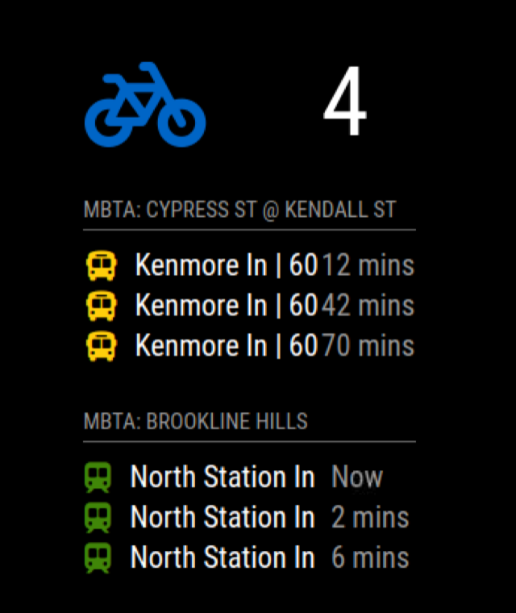
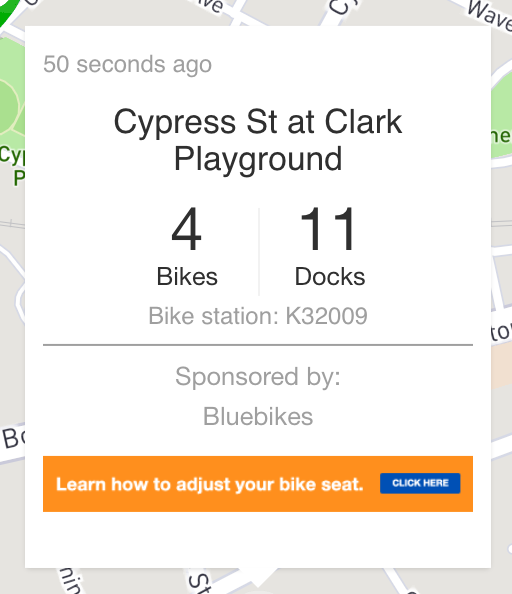

# MMM-Bluebikes

This is a [MagicMirror²](https://github.com/MichMich/MagicMirror) module to pull bike availability information for Bluebikes, Metro-Boston's Bikeshare Program. It is designed to pull bike availability information for one station at a time. It also has the ability to show eBike availability, if Bluebikes ever offers them.


## Installation

In your terminal, go to your MagicMirror's Module folder:

```bash
cd ~/MagicMirror/modules
```
Clone this repository:
```bash
git clone https://github.com/rcberg3/MMM-Bluebikes.git
```
Configure the module in your config.js file.

## Using the module

To use this module, add it to the modules array in the `config/config.js` file:
```js
modules: [
    {
        module: 'MMM-Bluebike',
        position: 'bottom_left', // This can be any of the regions.
        config: {
            station_number: 'your station number',
            show_eBikes: false
        }
    }
]
```

## Station number
For this module to work you will need to know your station id number. Have a look at stations.json to correlate station names with station id numbers. You can also go to the Bluebike website at https://member.bluebikes.com/map/ to navigate to your station, click on it, and see the bike station's short name. You then can use that short name to find the station id number in stations.json


## Configuration options

Option|Description
------|-----------
`BaseURL`|The API URL for Bluebikes for Metro Boston. Set this if the URL ever changes or you want to try getting data from a different city. Bluebikes is run by Motivate who is a subsidiary of Lyft and also runs bike shares for other cities. I cannot guarantee that the URLs can be switched out, but open an issue and I can take a look.
`station_number`|The station number of which to show bike availability. [See above](https://github.com/rcberg3/MMM-Bluebikes#station-number).<br/>**Default** = `187`.<br/>**Expected Value type:** `int`
`show_eBikes`|True/false whether to show ebike availability. Boston currently has none, but they could at some point.<br/>**Expected Value type:** `boolean`
`reload`|The frequency, in minutes, of which the module should reload data.<br/>**Default** = `3`.<br/>**Expected Value type:** `int`
